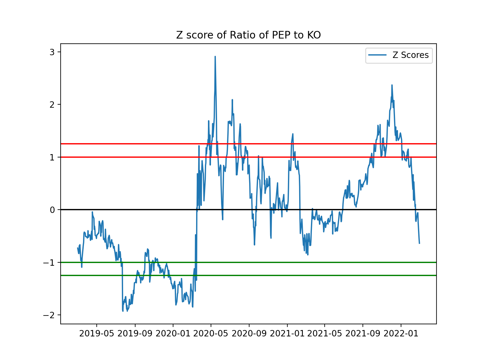

# quant_strategy
<div id="top"></div>

  <p align="center">
    Statistical Arbitrage Strategy |
    Backtesting |
    Portfolio simulation |
    Research Data visualization 
   </p>
    
   <a href="https://github.com/mm4700/quant_strategy/tree/develop/results">View Research/Backtesing Results</a>


<!-- GETTING STARTED -->
## Getting Started

This is an example of how you may give instructions on setting up your project locally.
To get a local copy up and running follow these simple example steps.

### Installation

1. Clone the repo
   ```sh
   git clone https://github.com/mm4700/quant_strategy.git
   ```
2. Install pip packages
   ```sh
   pip install -r requirements
   ```

<p align="right">(<a href="#top">back to top</a>)</p>


<!-- USAGE EXAMPLES -->
## Usage
 This project is written to do the equity research and backtesting quant strategies.
</br>

<p align="right">(<a href="#top">back to top</a>)</p>


<!-- ROADMAP -->
## Roadmap

- [ ] Pairs Trading Strategy
- [ ] Pairs Trading Strategy with stop loss and beta loading
- [ ] Monte carlo simulation for sharpe ratio


<!-- Research-->
# Research

## Pairs Trading Strategy Overview
Pairs trading is a form of mean-reversion that has a distinct advantage of always being hedged against market movements. It is generally a high alpha strategy when backed up by some rigorous statistics. The stratey is based on mathematical analysis.


Long Pair: Long stock A and short stock B
Short Pair: Short stock A and long stock B
You want to find a high correlation between stock A and B's price (usually > 0.8). 
If you find a relationship suggesting that the prices move in opposite directions, you can capitalize on this behavior. ONCE the assets deviate from their typical correlation, say 0.5, you can long/short the pair since you expect the correlation to converge back to its original form.
Sort of becomes an art when you try to maximize the spread between the assets


## Augmented Dickey Fuller
In order to test for stationarity, we need to test for something called a unit root. Autoregressive unit root test is based on the following hypothesis test:


## KPSS test
The Kwiatkowski–Phillips–Schmidt–Shin (KPSS) test figures out if a time series is stationary around a mean or linear trend, or is non-stationary due to a unit root. A stationary time series is one where statistical properties — like the mean and variance — are constant over time.

The null hypothesis for the test is that the data is stationary.
The alternate hypothesis for the test is that the data is not stationary.
The KPSS test is based on linear regression. It breaks up a series into three parts: a deterministic trend (βt), a random walk (rt), and a stationary error (εt), with the regression equation:


## Engle-Granger Test
The idea of Engle-Granger test is simple. We perform a linear regression between the two asset prices and check if the residual is stationary using the Augmented Dick-Fuller (ADF) test. If the residual is stationary, then the two asset prices are cointegrated. The cointegration coefficient is obtained as the coefficient of the regressor.

An immediate problem is in front of us. Which asset should we choose as the dependent variable? A feasible heuristic is that we run the linear regression twice using each asset as the dependent variable, respectively. The final \beta would be the combination that yields a more significant ADF test.

## Cointegration
The correlations between financial quantities are notoriously unstable. Nevertheless, correlations are regularly used in almost all multivariate financial problems. An alternative statistical measure to correlation is cointegration. This is probably a more robust measure of linkage between two financial quantities, but as yet there is little derivatives theory based on this concept.

Two stocks may be perfectly correlated over short timescales, yet diverge in the long run, with one growing and the other decaying. Conversely, two stocks may follow each other, never being more than a certain distance apart, but with any correlation, positive, negative, or varying. If we are delta hedging, then maybe the short timescale correlation matters, but not if we are holding stocks for a long time in an unhedged portfolio.

#Testing for Cointegration
The steps in the cointegration test procdure:


<!-- Strategy Simulation-->
# Strategy Simulation

### Correlation heat map
Pick the stocks pairs with high correlation


### Conintegration test for PEP and KO
#### Augmented Dickey-Fuller Test
 ```sh
We want the P val < 0.05 (meaning that cointegration exists)
P value for the augmented Engle-Granger two-step cointegration test is 0.0007596845602489357
P value for the PEP Augmented Dickey-Fuller Test is 0.1493608183193515
P value for  the KO Augmented Dickey-Fuller Test is 0.4085723353458443
P value for the spread Augmented Dickey-Fuller Test is 0.015259706229845139
P value for the ratio PEP/KO  Augmented Dickey-Fuller Test is 0.004164047909450876
 ```

### Mean reversion pair trading strategy simulation
1) Find 2 assets that move similarly with eachother (whether it be a negative or positive correlation)
2) Sell the 'overvalued' stock and buy the 'undervalued' stock -- A common signal to use to triger the purchase of a pair trade is to use the Price Ratio (Stock A / Stock B). If the ratio changes significantly, then you know it is time to trade. 'Significance' can be measured with standard deviation.

1, PEP and KO Stock Price relationship:


2, Spread between PEP and KO:


3,Price ratio between PEP and KO:


4, Z score ratio of PEP and KO:



5, Rolling Average 5d 20d with price ratio PEP/KO:


6, Rolling Average Price ratio(PEP/KO) Z-score:


7, Buy/Sell signal simulation for PEP and KO:


<p align="right">(<a href="#top">back to top</a>)</p>

<!-- Back Testing-->
## Back Testing
### Rolling avg with Stop loss and beta reloading strategy

<a href="https://github.com/mm4700/quant_strategy/tree/develop/strategies">View Strategy Code</a>
*based on following variables:
  ```sh
   # specifying rolling window length
    window = 21
    # specifying maximum KPSS statistic (95% critical value)
    KPSS_max = 0.463
    # specifying the KPSS test (one-parameter unbiased or two-parameter)
    unbiased = 1
    # specifying whether to perform beta-loading or not
    beta_loading = 1
    # strategy parameters - trading fee, optimal entry (divergence), and stop-loss
    fee = 0.0001
    entry = 0.02
    stop_loss = -0.05
    # specifying the sample
    start = datetime(2019, 3, 1)
    end = datetime(2022, 3, 1)
  ```

1, Gross return PEP-KO:


2, Net return PEP-KO:


3, Compare with Market return:


4, KPSS and buy/sell signal daily:


<a href="https://github.com/mm4700/quant_strategy/tree/develop/results/PEP-KO_BETA_LOADING/output_PEP_KO.csv">View Daily Signal Results</a>

<p align="right">(<a href="#top">back to top</a>)</p>


<!-- Portfolio Simulation-->
## Portfolio Simulation
### Monte Carlo Simulation for sharpe ratio (efficient frontier)

### Sharpe Ratio
Measuring the Adjusted Risk of Return
Measures the risk adjusted rate of return of a portfolio.


1, Efficient frontier plot:

Blue dot: min risk adjusted return |
Red dot: max risk adjusted return

<a href="https://github.com/mm4700/quant_strategy/blob/develop/simulation/monte_carlo_simulation_portfolio.py">View Simulation Code</a>


2, Risk Adjusted return result:

[risk_adjusted_return.csv](https://github.com/mm4700/quant_strategy/files/8185937/risk_adjusted_return.csv)


<p align="right">(<a href="#top">back to top</a>)</p>

<!-- Reference-->
## Reference

References:
 [Documentation1](https://www.econstor.eu/bitstream/10419/116783/1/833997289.pdf)
 [Documentation2](https://kidquant.com/project/pairs-trading-strategies-in-python/)
